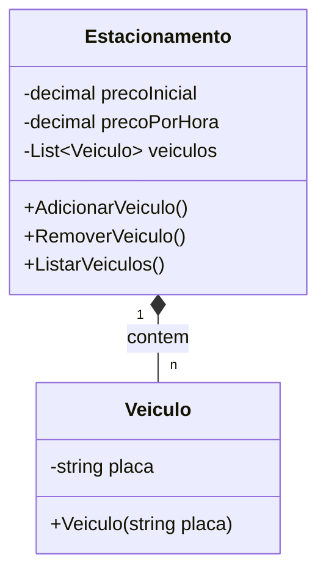

# Sistema de Gerenciamento de um Estacionamento

## Contexto

O **Parking System** é um sistema de gerenciamento de estacionamento simples, desenvolvido em C# como exercício para fixar fundamentos da linguagem aprendidos durante o [Bootcamp da DIO](https://web.dio.me/track/coding-the-future-xp-full-stack-developer). Ele permite que o usuário adicione, remova e liste veículos estacionados, além de calcular o preço total com base no tempo de permanência de cada veículo.

## Funcionalidades

- **Adicionar veículo**: Registra a placa de um veículo no estacionamento.
- **Remover veículo**: Remove o veículo estacionado e calcula o valor total a ser pago com base no tempo de permanência.
- **Listar veículos**: Exibe todos os veículos atualmente estacionados.

## Estrutura do Projeto

O projeto está organizado em duas camadas principais:

- **Models**: Contém o modelo de dados `Veiculo`, representando as informações de cada veículo estacionado.
- **Services**: Contém a lógica de negócios do estacionamento, como adicionar, remover e listar veículos.

## Diagrama dos Dados


## Pré-requisitos

- .NET SDK
- Um ambiente de desenvolvimento C# (como Visual Studio ou Visual Studio Code)

## Como Executar

1. Clone este repositório para o seu ambiente local:

   ```bash
   git clone git@github.com:juanvformoso/parking-management-system-project.git
   cd parking-management-system-project

2. Compile e execute o projeto:
    ```bash
    dotnet run

3. Siga as instruções exibidas no terminal para interagir com o sistema.